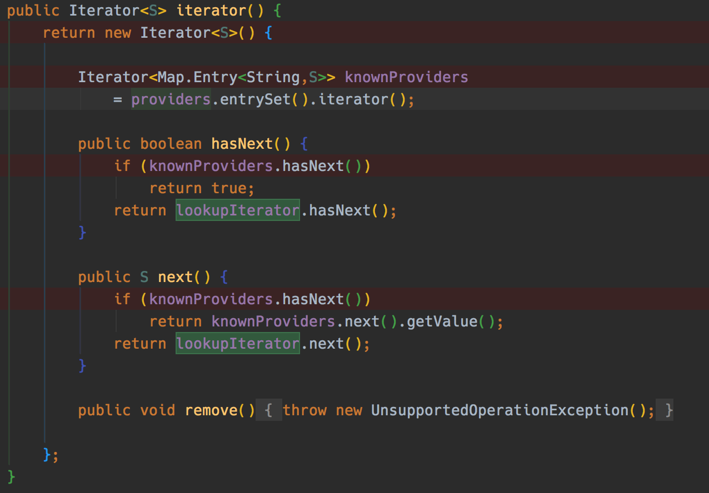

## Java-SPI

[TOC]

### 使用

源代码见

>https://github.com/wudkj/sumile-demo-spi/tree/master/sumile-demo-spi

新建接口类`SpiDemoService`,并创建两个子类继承该类:

```java
package cn.sumile.demo.spi;
public interface SpiDemoService {
    void showSpi();
}
```

```java
public class SpiServiceFirst implements SpiDemoService {
    @Override
    public void showSpi() {
        System.out.println("SpiServiceFirst");
    }
}
```

在`resourse`目录下新建文件夹`META-INF/services`,并创建**==文本==**文件(A文件),名称为接口类的`package+类名`

> cn.sumile.demo.spi.SpiDemoService

在main方法中调用(Demo1)

```java
public class MainClass {
    public static void main(String[] args) {
        ServiceLoader<SpiDemoService> spiDemoService = ServiceLoader.load(SpiDemoService.class);
        Iterator<SpiDemoService> iterator = spiDemoService.iterator();
        while (iterator.hasNext()){
            SpiDemoService service = iterator.next();
            service.showSpi();
        }
    }
}
```

输出为:

```
SpiServiceFirst
SpiServiceSecond
```

 **一些疑问:**

> 如果这个接口类是某一个类的内部类,该如何创建A文件

举例如(Demo2):

```java
public interface SpiDemoServiceTest {
    interface SpiDemoService {
        void showSpi();
    }
}
```

那么我使用如下的文件名来创建A文件可行么?

```
cn.sumile.demo.spi.SpiDemoServiceTest.SpiDemoService
```

这个需要看他的源码中是如何执行的了

### 执行过程

#### 初始化`LazyIterator`

```java
ServiceLoader.load(SpiDemoService.class);
```

在这段代码执行的过程中,他会初始化一个`LazyIterator`,变量名为:`lookupIterator`,这个`LazyIterator`继承于`Iterator`,所以自然包含`hasNext()`方法.

#### 将`hasNext()`方法的调用转发给`LazyIterator`的`hasNext()`

在初始化完成之后,代码开始调用`spiDemoService.iterator();`



可以看到是new了一个`Iterator`,在内部实现类中,会去调用`lookupIterator`的`hasNext`方法.(`providers`没有值,所以`knownProviders`就没有值,所以代码实际运行的是`lookupIterator.hasNext()`)

所以,实际上`main`方法中的`hasNext()`,实际上运行的是创建的`LazyIterator`中的`hasNext()`.

#### 找到配置文件

为了找到配置文件,在`ServiceLoad`类中,他规定了一个固定的位置去找,参数名叫:

```java
private static final String PREFIX = "META-INF/services/"
```

所以,这就是为什么要在`resources`下面创建这两个文件夹的原因.

之后,他会去找当前这个接口对应的`配置文件`,查找的路径是

```java
String fullName = PREFIX + service.getName();
```

`service.getName()`获取到的类的名称.而这个名称,在`Demo1`中 = `cn.sumile.demo.spi.SpiDemoService`,而在`Demo2`中,该值为`cn.sumile.demo.spi.SpiDemoServiceTest$SpiDemoService`.

这样,就知道了文件该如何命名:

```
cn.sumile.demo.spi.SpiDemoServiceTest$SpiDemoService
```

#### 实例化

通过以下几句代码,就把这个对象实例化并返回去了

```java
String cn = nextName;
nextName = null;
Class<?> c = null;
try {
		c = Class.forName(cn, false, loader);
} catch (ClassNotFoundException x) {
		fail(service,"Provider " + cn + " not found");
}
if (!service.isAssignableFrom(c)) {
		fail(service,"Provider " + cn  + " not a subtype");
}
try {
		S p = service.cast(c.newInstance());
		providers.put(cn, p);
		return p;
} catch (Throwable x) {
		fail(service,"Provider " + cn + " could not be instantiated",x);
}
```


